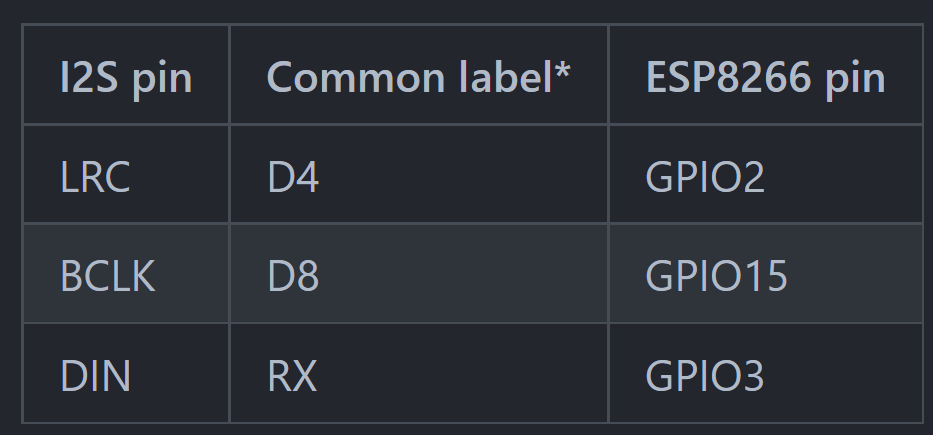

# Signals!

this Prototype of a speaking toy was developed in a two weeks Programm at School of Machines Making and make belive. https://www.schoolofma.org/ Thank you for the support!

## Hardware
- ESP8266 Wemos D1 Mini
- I2S DAC 
- Speaker
- Powerbank
- Jumper Wire

## How to connect

## How to setup the ESP8266

## Software
The Code in this repository is based on this great library

https://github.com/earlephilhower/ESP8266SAM

## Results

https://user-images.githubusercontent.com/60431784/173544948-70309132-fd99-4f4e-b040-91452b77a85c.mov

