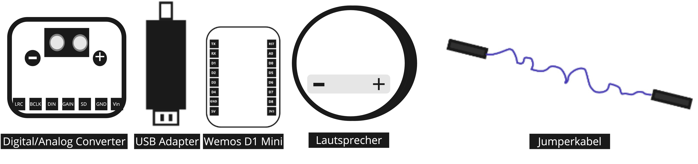
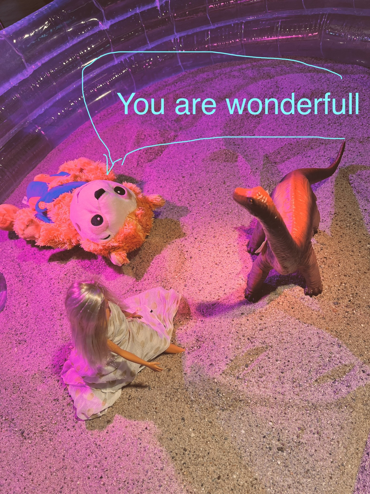

# Signals!

this Prototype of a speaking toy was developed in a two weeks Programm at School of Machines Making and make belive. https://www.schoolofma.org/ Thank you for the support!

## Hardware

- ESP8266 Wemos D1 Mini
- I2S DAC 
- Speaker
- Powerbank + USB (data)cable
- 5 Jumper Wires
- 2 cables to connect speaker with DAC

## How to connect - Der Bauplan

## How to get started

Download Arduino - Programmierumgebung

https://www.arduino.cc/en/software

Mikrocontroller einrichten - Set up ESP8266

https://github.com/Sarapedia/werkstatt/blob/master/Mikrocontroller_einrichten/WemosD1Mini.md

## Software
The Code in this repository is based on this great libraries

https://github.com/earlephilhower/ESP8266Audio/

https://github.com/earlephilhower/ESP8266SAM

Change the WiFi passwort and name in the following code, upload, have fun!

https://github.com/Sarapedia/Signals/blob/main/sam_hotspot.ino

## Results

https://user-images.githubusercontent.com/60431784/173544948-70309132-fd99-4f4e-b040-91452b77a85c.mov

